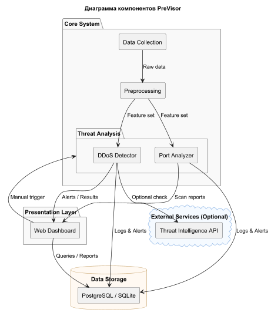

# PreVisor: Веб-система предиктивного мониторинга IT-инфраструктуры


## Описание проекта
PreVisor — веб-система для предиктивного мониторинга сетевой IT-инфраструктуры, использующая машинное обучение (ML) для прогнозирования сбоев и киберугроз. Система анализирует сетевой трафик, выявляет DDoS-атаки, подозрительные подключения по портам, сетевое сканирование и аномалии в HTTP-трафике, предоставляя администратору удобный дашборд с алертами и рекомендациями.

**Предназначение сервиса (цель работы):** 

Снизить время простоя (downtime) за счёт раннего обнаружения проблем, что особенно актуально для корпоративных сетей (например, банков, страховых компаний).

## Текущий статус
0. [ ] Начальная разработка (настройка окружения, выбор данных, базовый Flask-сервер).

## Установка и запуск
1. Клонируйте репозиторий:
   ```bash
   git clone "https://github.com/k00000tek/previsor"
   cd PreVisor

2. Создайте и активируйте виртуальное окружение:
    ```bash
    bashpython -m venv .venv
    source .venv/bin/activate  # Linux/macOS
    .venv\Scripts\activate     # Windows

3. Установите зависимости:
    ```bash
    pip install -r requirements.txt

4. Запустите сервер:
    ```bash
    python app.py
   
Доступ: http://127.0.0.1:5000/health

## Технологический стек

* **Backend:** Flask, Pandas, Scikit-learn/XGBoost.
* **Frontend:** Jinja2, Bootstrap, Plotly/Matplotlib.
* **База данных:** SQLite/PostgreSQL.
* **Сбор данных:** Scapy, Faker, Requests.
* **Анализ:** Эвристики и ML для DDoS, портов, сканирования и HTTP-аномалий; интеграция с внешними API (например, AbuseIPDB).
* **Дополнительно:** Celery, SQLAlchemy.

## Структура проекта
    PreVisor/
    ├── .venv/              # Виртуальное окружение
    ├── data/               # Датасеты и симулированные данные
    ├── static/             # CSS, JS, изображения
    ├── templates/          # HTML-шаблоны для Flask
    ├── app.py              # Главный файл Flask-приложения
    ├── requirements.txt    # Зависимости
    ├── .gitignore          # Игнорируемые файлы
    └── README.md           # Документация

## Архитектура
PreVisor состоит из пяти основных компонентов:

1. **Модуль сбора данных (Data Collection)**: Собирает сетевой трафик (логи, метрики) из симулированных источников или датасетов.
2. **Модуль предобработки данных (Data Preprocessing):** Очищает и преобразует данные для ML/эвристик.
3. **Модуль анализа (Analysis Module):** Выявляет угрозы/сбои с помощью ML и эвристик.
4. **Хранилище данных (Database):** Хранит логи и алерты для истории и дашборда.
5. **Веб-интерфейс (Web Interface):** Отображает дашборд и алерты для администратора.

## Структурные и поведенческие диаграммы




## Планы разработки
1. [ ] Сбор и предобработка данных (симуляция и датасеты).
2. [ ] Реализация ML/эвристических модулей для анализа угроз.
3. [ ] Разработка дашборда с визуализацией.
4. [ ] Тестирование и оптимизация.

## Контакты
Для предложений и вопросов: [tg:@zzlawlzz](t.me/zzlawlzz).

---

_Разработано в рамках ВКР, кафедра Сетевых информационных технологий и сервисов, 2025._